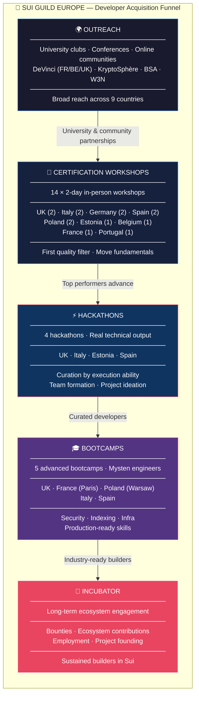
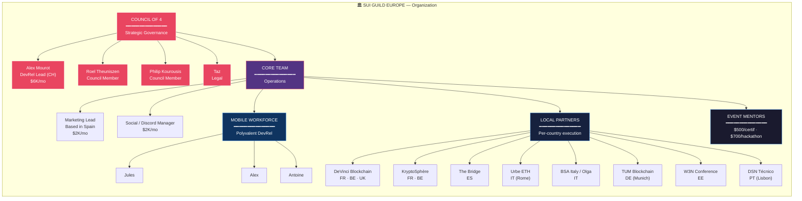
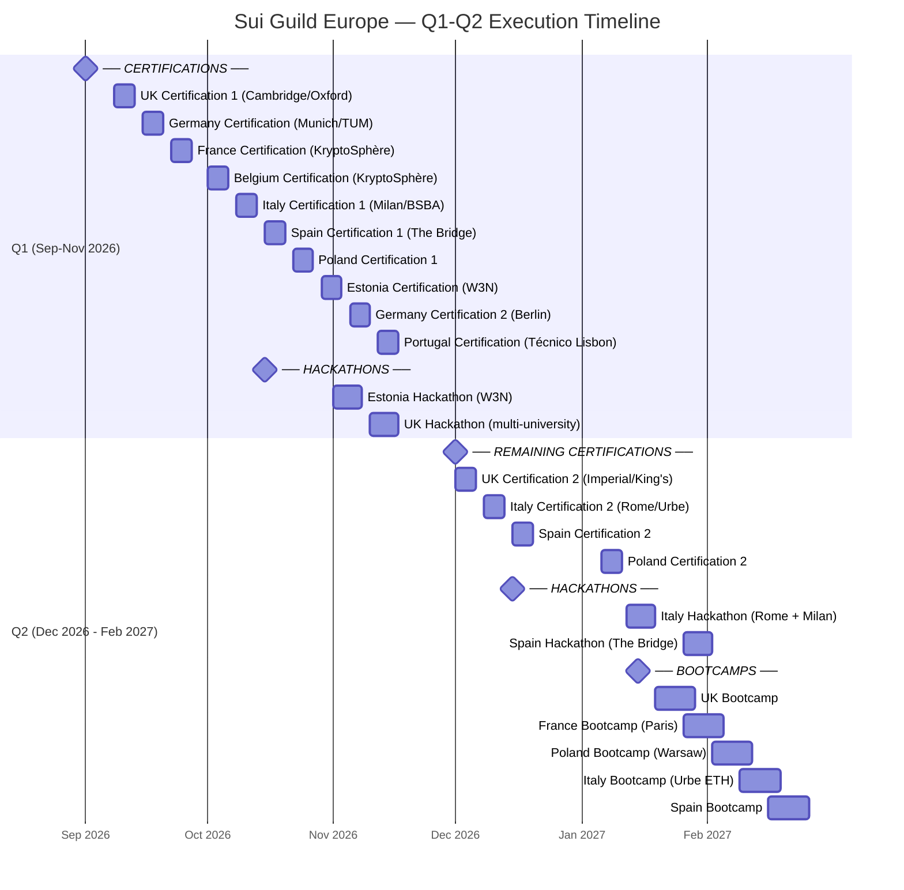
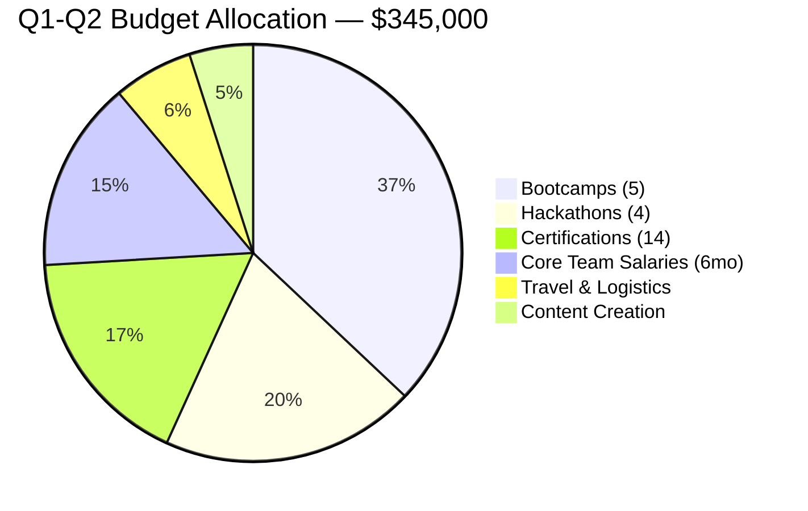

# Sui Guild Europe — Diagrams

## 1. Developer Acquisition Funnel

## 2. European Network — Events & Partners by Country

```mermaid
graph TB
    subgraph EUROPE["🇪🇺 SUI GUILD EUROPE — Network Map"]
        direction TB

        HQ["🏛️ COUNCIL OF 4\nAlex Mourot · Roel Theuniszen\nPhilip Kourousis · Taz (Legal)"]

        subgraph UK["🇬🇧 UNITED KINGDOM"]
            UK_E["2 Certifications · 1 Hackathon · 1 Bootcamp"]
            UK_P["Imperial College · Cambridge\nOxford · King's College\nDeVinci Blockchain"]
        end

        subgraph FR["🇫🇷 FRANCE"]
            FR_E["1 Certification · 1 Bootcamp (Paris)"]
            FR_P["KryptoSphère\nDeVinci Blockchain (HQ, 12+ antennas)"]
        end

        subgraph DE["🇩🇪 GERMANY"]
            DE_E["2 Certifications"]
            DE_P["TUM Blockchain Club (Munich)\nBerlin Conference Organizer"]
        end

        subgraph ES["🇪🇸 SPAIN"]
            ES_E["2 Certifications · 1 Hackathon · 1 Bootcamp"]
            ES_P["The Bridge"]
        end

        subgraph IT["🇮🇹 ITALY"]
            IT_E["2 Certifications · 1 Hackathon · 1 Bootcamp"]
            IT_P["Urbe ETH (Rome) — Bootcamp partner\nBSA Italy / Olga Arzhaeva\nBSBA (Milan)"]
        end

        subgraph PL["🇵🇱 POLAND"]
            PL_E["2 Certifications · 1 Bootcamp (Warsaw)"]
            PL_P["Local dev community"]
        end

        subgraph EE["🇪🇪 ESTONIA"]
            EE_E["1 Certification · 1 Hackathon"]
            EE_P["W3N Conference"]
        end

        subgraph BE["🇧🇪 BELGIUM"]
            BE_E["1 Certification"]
            BE_P["KryptoSphère\nDeVinci Blockchain"]
        end

        subgraph PT["🇵🇹 PORTUGAL"]
            PT_E["1 Certification"]
            PT_P["Decentralized Student Network (Técnico Lisbon)\nJose (via Roel) · Pedro (BSA)"]
        end

        HQ --> UK
        HQ --> FR
        HQ --> DE
        HQ --> ES
        HQ --> IT
        HQ --> PL
        HQ --> EE
        HQ --> BE
        HQ --> PT
    end

    style HQ fill:#e94560,stroke:#fff,color:#fff
    style UK fill:#1a1a2e,stroke:#4a9eff,color:#fff
    style FR fill:#1a1a2e,stroke:#4a9eff,color:#fff
    style DE fill:#1a1a2e,stroke:#4a9eff,color:#fff
    style ES fill:#1a1a2e,stroke:#4a9eff,color:#fff
    style IT fill:#1a1a2e,stroke:#4a9eff,color:#fff
    style PL fill:#1a1a2e,stroke:#4a9eff,color:#fff
    style EE fill:#1a1a2e,stroke:#4a9eff,color:#fff
    style BE fill:#1a1a2e,stroke:#4a9eff,color:#fff
    style PT fill:#1a1a2e,stroke:#4a9eff,color:#fff
```

## 3. Organization Structure

## 4. Q1-Q2 Timeline (Sep 2026 — Feb 2027)

## Updated Budget (with Portugal + Germany additions)

| Category | Unit Cost | Qty | Total |
|---|---|---|---|
| Bootcamps (UK, Paris, Poland, Italy, Spain) | $30,000 | 5 | $150,000 |
| Hackathons (ops + prize pool) | $20,000 | 4 | $80,000 |
| 2-Day Certification Workshops | $5,000 | 14 | $70,000 |
| Travel & Logistics | — | — | $25,000 |
| Content Creation | $1,000 | 15–20 | $20,000 |
| Core Team Salaries (6 months) | $10,000/mo | 6 | $60,000 |
| **TOTAL** | | | **$345,000** |

*Note: +2 certifications (Germany Berlin + Portugal) = +$10K certs, +$5K travel vs original budget.*
